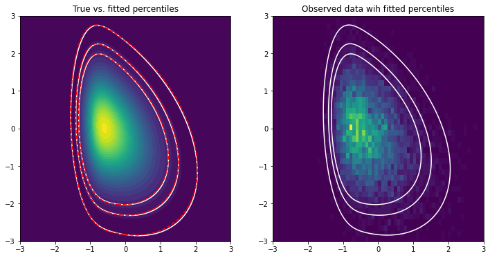

# Maximum Likelihood Estimation in Multivariate Probability Distributions Using EM Algorithms

To my surprise, ```scipy.stats``` include very few multivariate probability distributions, and neither of the implemented distributions has an associated parameter estimation method. In contrast, R (:heart_eyes:) has more or less everything a statistician desires. Hence, if you are stuck with Python, this repository attempts to include parameter estimation methods for the most common continuous probability distributions using EM (or modified EM) algorithms.

Currently included:
- normal (```mvem.stats.multivariate_norm```)
- skew normal (```mvem.stats.multivariate_skewnorm```)
- Student's *t* (```mvem.stats.multivariate_t```)
- normal-inverse Gaussian (```mvem.stats.multivariate_norminvgauss```)
- generalised hyperbolic skew Student's *t* (```mvem.stats.multivariate_genskewt```)
- generalised hyperbolic (```mvem.stats.multivariate_genhyperbolic```)
- hyperbolic (```mvem.stats.multivariate_hyperbolic```)
- variance-gamma (```mvem.stats.multivariate_vargamma```)

I am also working on including a few multivariate mixture models. Currently included:
- skew normal (```mvem.mixture.skewnorm```)

## Example



## Current library structure:

```
mvem
|_ stats
   |_ multivariate_normal.py
      |_ fit, pdf, logpdf, rvs, mean, var
   |_ multivariate_t.py
      |_ fit, pdf, logpdf, rvs, mean, var
   ...
|_ mixture
   |_ skewnorm.py
      |_ fit, pdf, rvs, predict
   ...
```

## Requirements

```
numpy
scikit-learn
scipy>=1.6
```